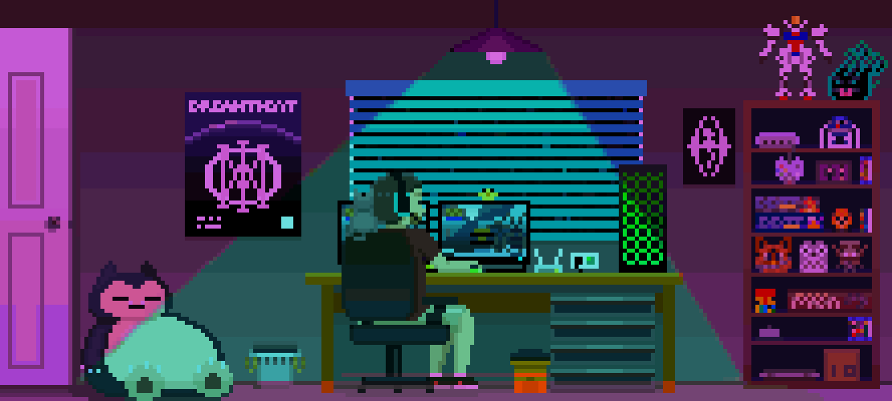

  
  

    <h1 class="hero-title">
      Hola, soy Gustavo Tuesta
    </h1>
    

      Software Engineering Student · Backend Developer
    

  

<!-- SOBRE MÍ -->

  

    <h2 style="
        color: #ffffff;
        font-size: clamp(21px, 2.7vw, 30px);
        margin: 0 0 18px;
        text-align: center;
    ">
      Sobre mí
    </h2>
    

      Soy estudiante de Ingeniería de Software con Inteligencia Artificial y desarrollador enfocado principalmente en el backend. Me gusta construir APIs, trabajar con bases de datos y desarrollar sistemas utilizando tecnologías como Node.js, NestJS y TypeScript. También exploro el campo de la Inteligencia Artificial y el Machine Learning, buscando combinar el desarrollo de software con soluciones inteligentes. Actualmente dedico gran parte de mi tiempo a aprender, desarrollar proyectos propios y enfrentar nuevos retos que me permitan seguir creciendo como desarrollador.
    

  

  

    
  

<!-- TECNOLOGÍAS -->

  <h2 style="
      color: #ffffff;
      font-size: clamp(25px, 3.2vw, 30px);
      margin: 0 0 35px;
  ">
    Tecnologías
  </h2>
  

    <!-- TECNOLOGÍAS PRINCIPALES -->
    

      <h3 style="
          color: #ffffff;
          font-size: clamp(18px, 2.2vw, 20px);
          margin: 0 0 25px;
      ">
        Tecnologías principales
      </h3>
      

        
        
        
        
        
        
        
      

    

    <!-- EXPERIENCIA ADICIONAL -->
    

      <h3 style="
          color: #ffffff;
          font-size: clamp(18px, 2.2vw, 20px);
          margin: 0 0 25px;
      ">
        Experiencia adicional
      </h3>
      

        
        
        
        
        
        
        
      

    

  

<!-- GITHUB STREAK -->

  

