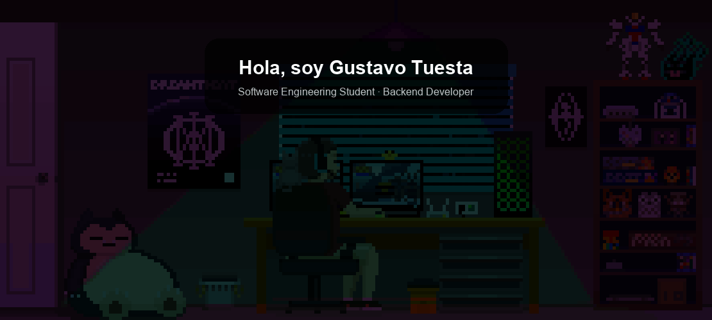
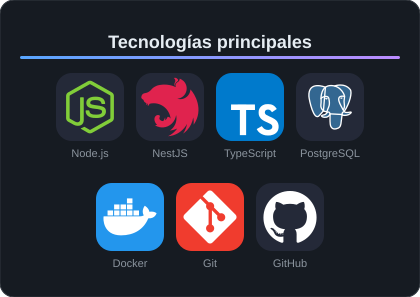
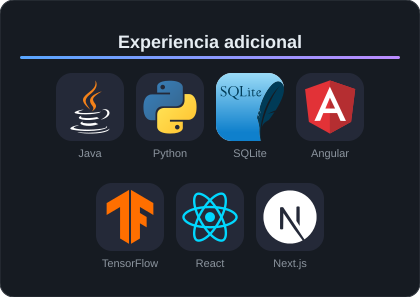

<!-- HERO -->

  

<!-- SOBRE MÍ -->
## Sobre mí

<table>
  <tr>
    <td valign="middle" width="62%">
      Soy estudiante de Ingeniería de Software con Inteligencia Artificial y desarrollador enfocado principalmente en el backend.
      Me gusta construir APIs, trabajar con bases de datos y desarrollar sistemas utilizando tecnologías como Node.js, NestJS y TypeScript.
      También exploro el campo de la Inteligencia Artificial y el Machine Learning, buscando combinar el desarrollo de software con soluciones inteligentes.
      Actualmente dedico gran parte de mi tiempo a aprender, desarrollar proyectos propios y enfrentar nuevos retos que me permitan seguir creciendo como desarrollador.
    </td>
    <td valign="middle" align="center" width="38%">
      
    </td>
  </tr>
</table>

<!-- TECNOLOGÍAS -->
## Tecnologías

<table align="center">
  <tr>
    <td align="center">
      
    </td>
    <td align="center">
      
    </td>
  </tr>
</table>

<!-- GITHUB STREAK -->
<!--

  

 
-->